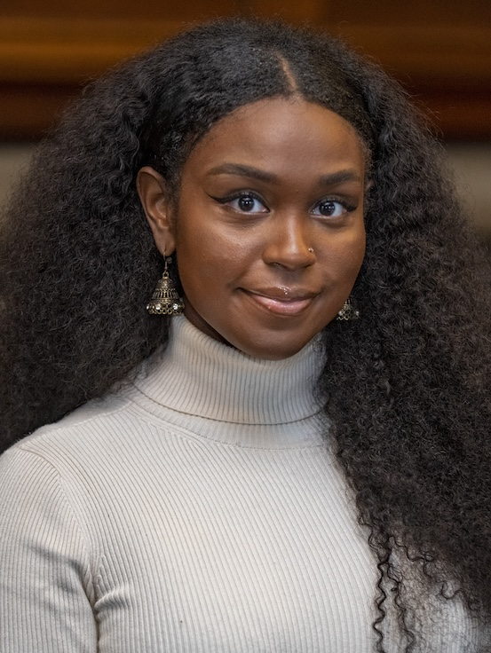

  <h1>About</h1>
  
  
Zaria Sawdijah El-Fil is a Ph.D candidate in the Department of History at the University of Chicago, where her research focuses on the legal and geopolitical dynamics of slavery along the U.S.-Mexico borderlands region – with special emphasis on how enslaved and free Black people engaged with legal systems across shifting national boundaries.

  
In the field of digital humanities, Zaria is interested in black digital approaches to data ethics, archiving, and pedagogy. Zaria is currently a Predoctoral Digital Research Fellow with LifexCode: DH Against Enclosure.

<h1 style="text-align:center">Research Interests</h1>

  

    

      

        <h2>Book History</h2>
        
subtext

        
Some text that describes my interests in this field.

      

    

  

  

    

      

        <h2>Digital Humanities</h2>
        
subtext

        
Some text that describes my interest in this field.

      

    

  

  

    

      

        <h2>Visual Design</h2>
        
subtext

        
Some text that describes my interest in this field.

      

    

  

